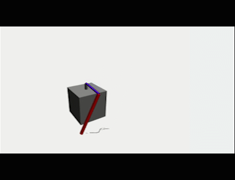
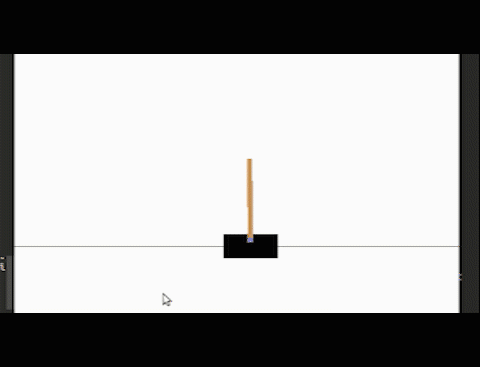
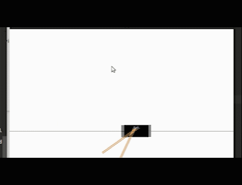
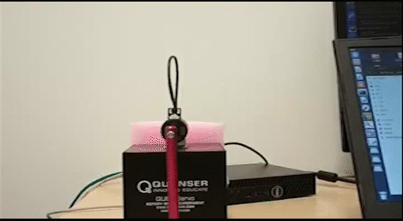

# Reinforcement Learning Course Project
Technische Universität Darmstadt winter semester 2018/2019

Supervisor: Jan Peters, Riad Akrour

This repository contains the PyTorch implementation of Deep Q-Network (DQN) and Model Predictive Control (MPC), 
and the evaluation of them on the [quanser robot platform](https://git.ias.informatik.tu-darmstadt.de/quanser/clients).

 
 

 

## Authors
+ Zuxin Liu (Implement algorithms, clean code, run experiment and write report)
+ Yunhao Li (Run experiment and write report)
+ Junfei Xiao (Run experiment and write report)

## Algorithms
+ [DQN](https://arxiv.org/abs/1312.5602)
+ [MPC](https://ieeexplore.ieee.org/abstract/document/8463189)

## Platforms
+ [Qube](https://git.ias.informatik.tu-darmstadt.de/quanser/clients/tree/master/quanser_robots/qube)
+ [Double Pendlum](https://git.ias.informatik.tu-darmstadt.de/quanser/clients/tree/master/quanser_robots/double_pendulum)
+ [Cartpole Swing-up](https://git.ias.informatik.tu-darmstadt.de/quanser/clients/tree/master/quanser_robots/cartpole)
+ [Cartpole Stab](https://git.ias.informatik.tu-darmstadt.de/quanser/clients/tree/master/quanser_robots/cartpole)

## Installation
For the installation of the Quanser robot simulation environment, please see [this page](https://git.ias.informatik.tu-darmstadt.de/quanser/clients)

For the implementation of the algorithms, the following packages are required:

+ python = 3.6.2
+ pytorch = 1.0.1
+ numpy = 1.12.1
+ matplotlib = 2.1.1
+ gym

You can simply create the same environment as ours by using [Anaconda](https://www.anaconda.com/).
All the required packages are included in the ```environment.yaml``` file. You can create the environment by the following command

```angular2html
conda env create -f environment.yaml
```
Then, activate your environment by 

```
source activate pytorch
```

## How to run

1. Choose the algorithm you want to use and change to the corresponding folder (DQN or MPC)
2. Choose the environment you want to evaluate and change to the folder (CartPoleStab, Double, Qube or Swing)
3. Change the configuration file ```config.yml``` to the parameters you want, and follow the instructions in the folder
